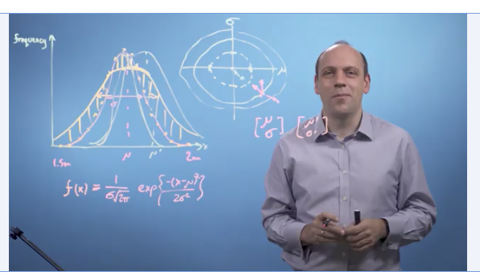

# Week 1 – Intro 

Why vectors? 

* Heights in a population follow a normal distribution, most people are clustered around the center: 
* Mean = μ (the center, miu)
* Standard deviation = σ (the width, sigma) 
* Area under curve = n = 100 (the size of population
* Gaussian distribution: $f(x) = {{1\over{σ\sigma\sqrt{2π\pi}}} {exp\{{-(x-\mu)^2 \over (2\sigma^2)}\}$
* How do we go about finding the best possible mu and sigma to fit this distribution? 
* By trial and error, set values for mu and sigma
* Evaluate fit based on areas inside and outside new curve 
* Plot different values on x-y axis of mu-sigma values in 2D space 
* If we could track how these values (of mu and sigma) change over each experiment (by evaluation of fit), we can express them as vectors, and calculate the direction of vectors to bring us to the smallest error 
* We can describe directions of these vectors along any sort of space beyond 2D planes 
* We can think of vectors as lists and apply them to many other problems 

--> We use vector math for calculaus to fit parameters and perform machine learning. 

 

