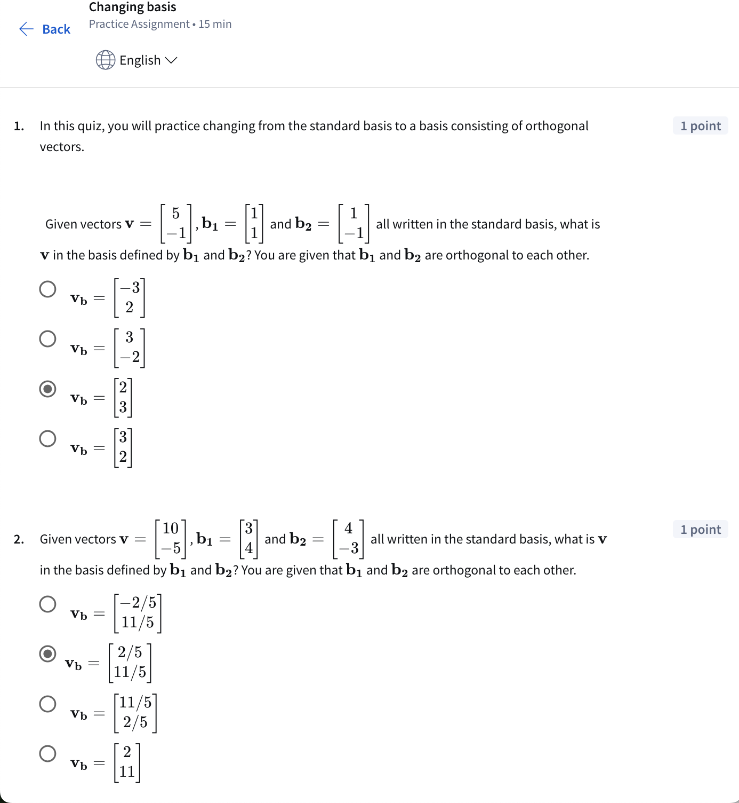
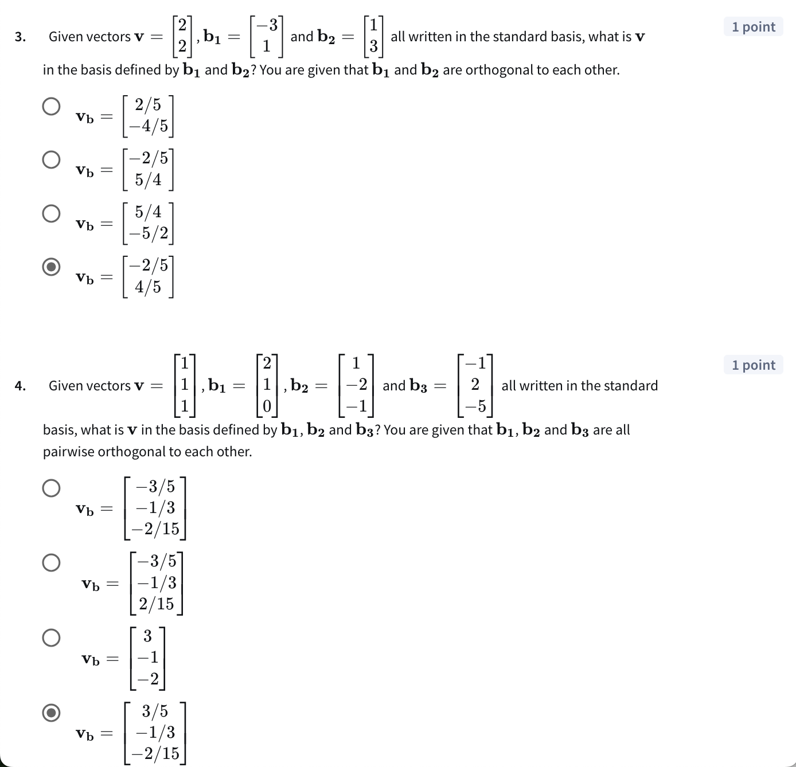
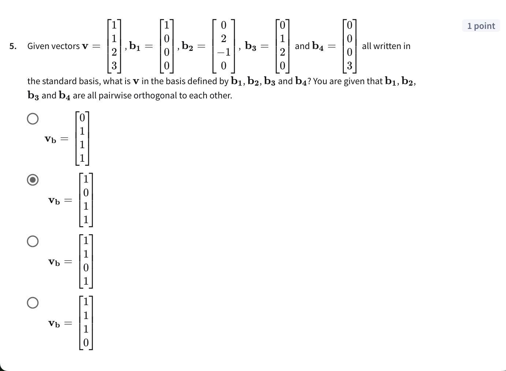

# Week2 - 

Practice assignment walkthrough. Workings at the top, screenshots at the bottom. 

### Q1: Given vectors **V** = [5, -1], **b1** = [1, 1] and **b2** = [1, -1] are all written in the standard basis, what is V in the basis defined by b1 and b2? You are given that b1 and b2 are orthogonal to each other. 

${b_1 . v = 5(1) + 1(-1)}$

${b_1 . v = 5-1}$

${b_1 . v = 4}$

${|b_1|}^2 = {\sqrt{1^2 + 1^2}}^2$

${|b_1|}^2 = 1+1$

${|b_1|}^2 = 2$

Therefore V in terms of b1 = ${b_1 . v \over {|b_1|}^2}(b_1) = {4 \over 2}(b_1) = 2(b_1)$

${b_2 . v = 5(1) + (-1)(-1)}$

${b_2 . v = 5+1}$

${b_2 . v = 6}$

${|b_2|}^2 = {\sqrt{(-1)^2 + (-1)^2}}^2$

${|b_2|}^2 = 1+1$

${|b_2|}^2 = 2$

Therefore V in terms of b1 = ${b_2 . v \over {|b_2|}^2}(b_2) 
= {6 \over 2}(b_2) = 3(b_2)$

Putting it together: V in terms of $ b_1, b_2 = \begin{pmatrix} 2b_1 \\ 3b_2 \end{pmatrix}; v_b = \begin{pmatrix} 2 \\ 3 \end{pmatrix}$

### Q2: Given vectors V = [10, 5] and b1 = [3, 4] and b2 = [4, -3] all written in the standard basis, what is **V** in the basis defined by b1 and b2? 

${b_1 . v = 3(10) + 4(-5)}$

${b_1 . v = 30-20}$

${b_1 . v = 10}$

${|b_1|}^2 = {\sqrt{3^2 + 4^2}}^2$

${|b_1|}^2 = 9+16$

${|b_1|}^2 = 25$

Therefore V in terms of b1 = ${b_1 . v \over {|b_1|}^2}(b_1) = {10 \over 25}(b_1) = {2 \over 5}(b_1)$

${b_2 . v = 4(10) + (-3)(-5)}$

${b_2 . v = 40+15}$

${b_2 . v = 55}$

${|b_2|}^2 = {\sqrt{(4)^2 + (-3)^2}}
^2$

${|b_2|}^2 = 16+9$

${|b_2|}^2 = 25$

Therefore V in terms of b1 = ${b_2 . v \over {|b_2|}^2}(b_2) = {60 \over 25}(b_2) = {11 \over 5}(b_2)$

Putting it together: V in terms of $ b_1, b_2 = \begin{pmatrix} 
{2 \over 5} b_1 \\ 
{11 \over 5}b_2 
\end{pmatrix}; v_b = 
\begin{pmatrix} 
2\over5 \\ 
11\over5 \end{pmatrix}$

### Q3: Given vectors V = [2, 2] and b1 = [-3, 1] and b2 = [1, 3] all written in the standard basis, what is **V** in the basis defined by b1 and b2? 

${b_1 . v = 2(-3) + 2(1)}$

${b_1 . v = -6+2}$

${b_1 . v = -4}$

${|b_1|}^2 = {\sqrt{(-3)^2 + 1^2}}^2$

${|b_1|}^2 = 9+1$

${|b_1|}^2 = 10$

Therefore V in terms of b1 = ${b_1 . v \over {|b_1|}^2}(b_1) = {-4 \over 10}(b_1) = {-2 \over 5}(b_1)$

${b_2 . v = 2(1) + 2(3)}$

${b_2 . v = 2+6}$

${b_2 . v = 8}$

${|b_2|}^2 = {\sqrt{(1)^2 + (3)^2}}^2$

${|b_2|}^2 = 1+9$

${|b_2|}^2 = 10$

Therefore V in terms of b1 = ${b_2 . v \over {|b_2|}^2}(b_2) = {8 \over 10}(b_2) = {4 \over 5}(b_2)$

Putting it together: V in terms of $ b_1, b_2 = \begin{pmatrix} {-2 \over 5} b_1 \\ {4 \over 5}b_2 \end{pmatrix}; v_b = \begin{pmatrix} -2\over5 \\ 4\over5 \end{pmatrix}$

### Q4: Given vectors V = [1, 1, 1] and b1 = [2, 1, 0] and b2 = [1, -2, -1] and b3 = [-1, 2, -5], and all are written in the standard basis, what is **V** in the basis defined by b1, b2 and b3? 

${b_1 . v = 1(2) + 1(1) + 1(0)}$

${b_1 . v = 2+1+0}$

${b_1 . v = 3}$

${|b_1|}^2 = {\sqrt{2^2 + 1^2 +0^2}}^2$

${|b_1|}^2 = 4+1+0$

${|b_1|}^2 = 5$

Therefore V in terms of b1 = ${b_1 . v \over {|b_1|}^2}(b_1) = {3 \over 5}(b_1)$

${b_2 . v = 1(1) + 1(-2) + 1(-1)}$

${b_2 . v = 1-2-1}$

${b_2 . v = -2}$

${|b_2|}^2 = {\sqrt{(1)^2 + (-2)^2 +(-1)^2}}^2$

${|b_2|}^2 = 1+4+1$

${|b_2|}^2 = 6$

Therefore V in terms of b1 = ${b_2 . v \over {|b_2|}^2}(b_2) = {-3 \over 6}(b_2) = {-1 \over 3}(b_2)$

${b_3 . v = 1(-1) + 1(2) + 1(-5)}$

${b_3 . v = -1+2-5}$

${b_3 . v = -4}$

${|b_3|}^2 = {\sqrt{(-1)^2 + (2)^2 +(-5)^2}}^2$

${|b_3|}^2 = 1+4+25$

${|b_3|}^2 = 30$

Therefore V in terms of b1 = ${b_2 . v \over {|b_2|}^2}(b_2) = {-4 \over 30}(b_2) = {-2 \over 15}(b_2)$

Putting it together: V in terms of $ b_1, b_2, b_3 = 
\begin{pmatrix} 
{3 \over 5}b_1 \\ 
{-1 \over 3}b_2 \\
{-2 \over 15}b_3
\end{pmatrix}; v_b = \begin{pmatrix} 
2\over5 \\ 
-1\over3 \\
-2\over15
\end{pmatrix}$

### Q5: Given vectors V = [1, 1, 2, 3] and b1 = [1, 0, 0, 0] and b2 = [0, 2, -1, 0] and b3 = [0, 1, 2,0], and b4 = [0, 0, 2, 3] all are written in the standard basis, what is **V** in the basis defined by b1, b2, b3 and b4?

${b_1 . v = 1(1) + 1(0) + 2(0) +3(0)}$

${b_1 . v = 1 + 0 + 0 + 0}$

${b_1 . v = 1}$

${|b_1|}^2 = {\sqrt{1^2}}^2$

${|b_1|}^2 = 1$

Therefore V in terms of b1 = ${b_1 . v \over {|b_1|}^2}(b_1) = {1}(b_1)$

${b_2 . v = 1(0) + 1(2) + 2(-1) +3(0)}$

${b_2 . v = 0+2-2+0}$

${b_2 . v = 0}$

We dont even have to calculate ${|b_2|}^2$ since ${b_2 . v = 0}$

Therefore V in terms of b2 = ${b_2 . v \over {|b_2|}^2}(b_2) = {0}(b_2)$

${b_3 . v = 1(0) + 1(1) + 2(2) + 3(0)}$

${b_3 . v = 0+1+4+0}$

${b_3 . v = 5}$

${|b_3|}^2 = {\sqrt{(0)^2 + (1)^2 + (2)^2 +(0)^2}}^2$

${|b_3|}^2 = 1+4$

${|b_3|}^2 = 5$

Therefore V in terms of b1 = ${b_2 . v \over {|b_2|}^2}(b_2) = {5 \over 5}(b_2) = {1}(b_2)$

${b_4 . v = 1(0) + 1(0) + 2(0) + 3(3)}$

${b_4 . v = 9}$

${|b_4|}^2 = {\sqrt{(0)^2 + (0)^2 + (0)^2 +(3)^2}}^2$

${|b_4|}^2 = 9$

Therefore V in terms of b1 = ${b_2 . v \over {|b_2|}^2}(b_2) = {9 \over 9}(b_2) = {1}(b_2)$

Putting it together: V in terms of $ b_1, b_2, b_3, b_4 = 
v_b = \begin{pmatrix} 
1 \\ 
1 \\
1 \\
0 \end{pmatrix}$

# Screenshots

