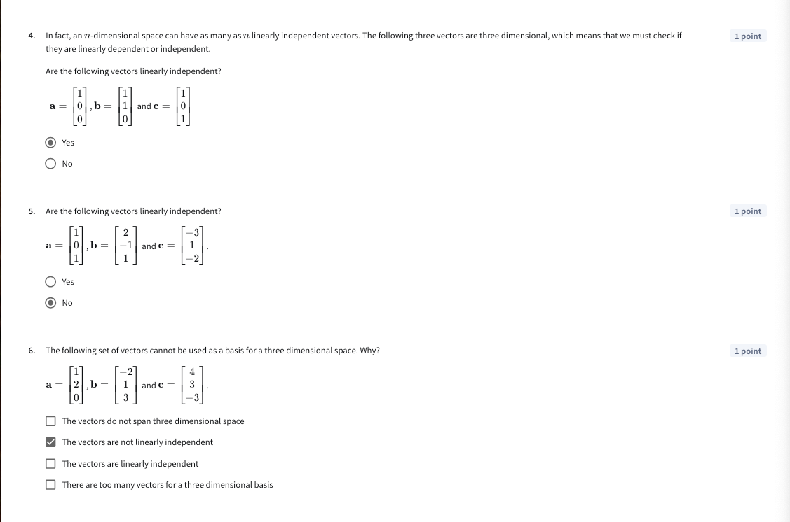

# Assigment – Linear Dependency of a set of vectors 

Explanation:

1. These vectors a = [1.1] and b=[2,2] are NOT linearly dependent because vector b can be expressed as a function of a, ie., b=2a. 
2. These vectors a = [1,1] and b=[2,1] are linearly INDEPENDENT because vector b CANNOT be expressed as a function of a. 
3. From the image, we can see a = [2,2], b=[1,-2] and c=[-1,0]. We can solve this as a pair of simultaneous linear equations, giving q1 = -1 and q2 = 3. 
4. We can check for linear independence by exploring whether vector c can be expressed as a function of a and b, and vice versa. They all cannot be expressed as a form of each other since vector b is the only one with '1' in the second dimension and vector c is the only vector with '1' in the third dimension. 
5. These are multiples of each other and hence are NOT linearly independent. 
6. Again, these vectors are NOT linearly independent. 

