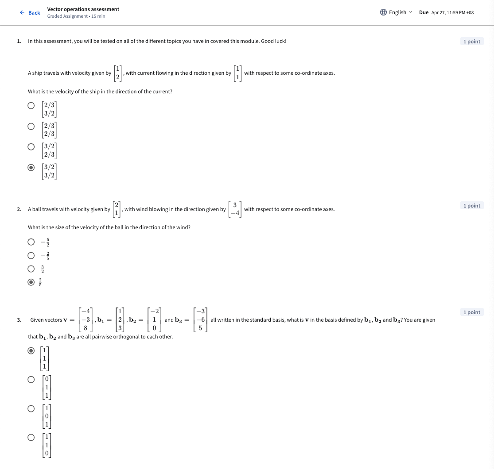
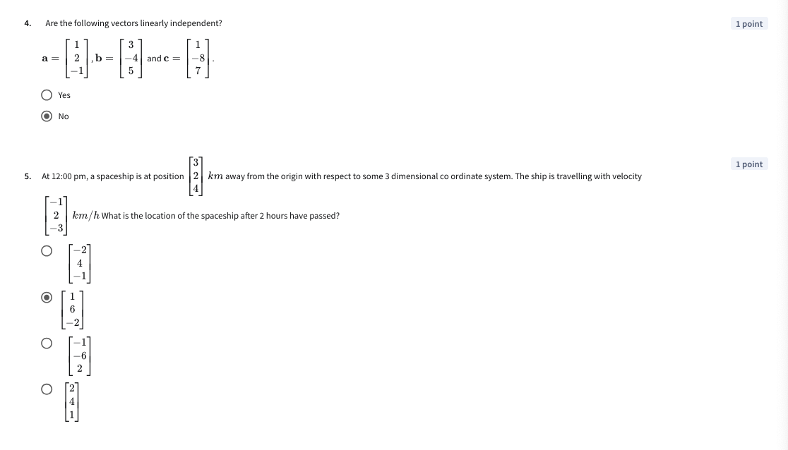

# Graded Assignment – Vector Operations Assessment

Explanation:

1. This question asks us to find the velocity of the ship, given the direction of the current. This is a question about finding the new vector with a changed basis (ie., the current). We can calculate the changed basis $r_e$ of the old vector $R$ on base $b_1$ using the formula ${r_e . b_1}\over{|b_1|^2} = {(1x1)+(2x1)}\over{(1x1)+(1x1)} = 3\over2 b_1 = [3/2, 3/2]$. 
2. This question is also about finding the new vector of a ball, with a changed basis (ie., the wind). We can calculate the changed basis $r_e$ of the old vector $R$ on base $b_1$ using the formula ${r_e . b_1}\over{|b_1|^2} = {(2x3)+(1x-4)}\over{(3x3)+(-4x-4} = 2\over-5$. Please note the answer in the screenshot is wrong but I am not going to resubmit the test.
3. Assuming that all vectors are orthorgonal to each other, we can calculate the new standard basis of $v$ in $b_1, b_2, b_3$ by finding their dot product (same as formula as above). 
4. These vectors are NOT linearly independent because vector b can expressed as a function of a and c, specifically: `b = 2a + c`. 
5. To find the new location of the spaceship after two hours, we need to add the old location of the spaceship, [3,2,4] with two units of hourly velocity [-1,2,-3] which gives us `[3,2,4] + 2[-1,2,-3] = [1,6,-2]`.

