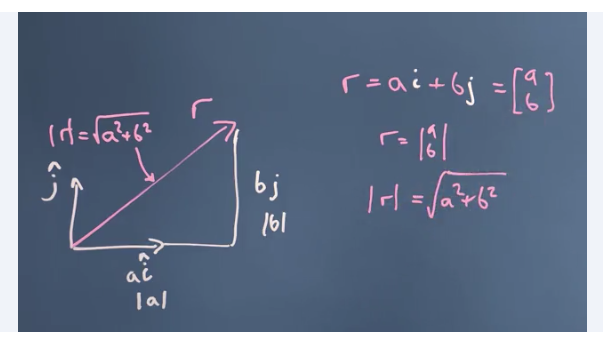
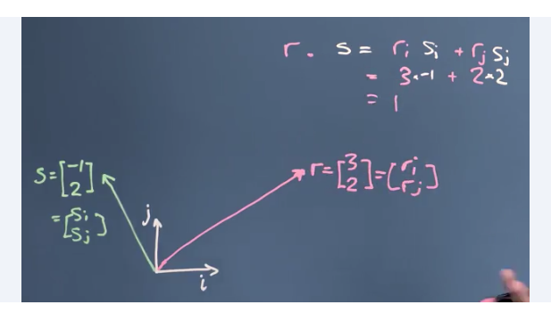
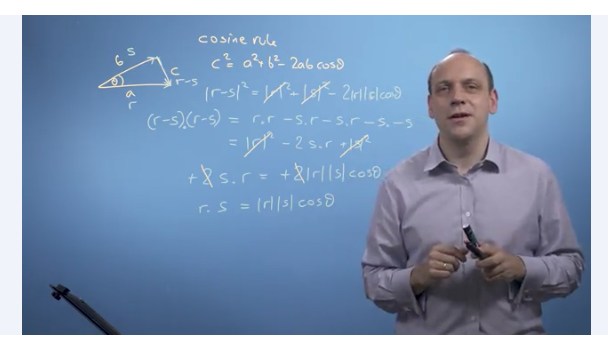
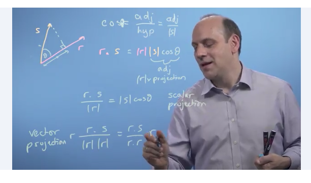
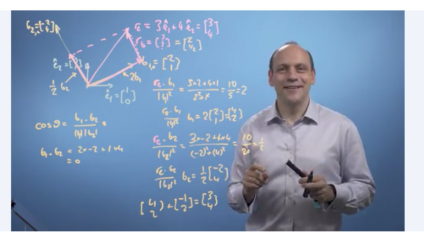

# Week 2 

### Modulus & Inner Product 

* Vectors have two things:
	* Size of a vector (aka the length of a vector) 
	* Dot product (aka inner scalar or projection product) 
* We need to learn to calculate the length and direction   

### Length 

* If a vector is constructed out of two orthorgonal vectors (ie., they are at a right angle), we can find the length using pythagoras's theorem 

$Vector R = ai + bj$

$Length of R = |r| = \sqrt{a^2 + b^2}$

* Another way to get the size of a vector is simply by taking the dot product of the vector with itself: 

$r.r = |r|^2$

### Dot product 

The dot product is just a number, found by multiplying the components of both vectors together, and adding them up. There are three properties:

* Commutative: The order of multiplication doesnt matter which comes first:

$r . s = (r_i s_i) + (r_j s_j)$

* Distributive over addition:

$r . (s+t) = r.s + r.t$

* Associative over scalar multiplication too: 

$r.(As) = A(r.s)$ 

### Cosine Rule

* Suppose we have a triangle with three sides, a, b, c 
* The cosine rule states that: 

$c^2 = a^2 b^2 - 2ab\cos\theta$ 

* We can rewrite one of the sides, c, as a-b 
* Rename the sides to s, r, t 
* We can say `t = r-s`
* Therefore rewriting it in the cosine rule... 

$|r-s|^2 = |r|^2 + |s|^2 - 2|r||s|\cos\theta$

--> $r.s = |r||s|\cos\theta$ 

* Recall
	* When $\theta = 0$ then $\cos\theta = 1$
	* When $\theta = 90$ then $\cos\theta = 0$
	* When $\theta = 180$ then $\cos\theta = -1$
* This means when the angle between the two vectors is zero (aka they are going in the exact same direction) then $r.s = |r||s|\cos\theta\ = |r||s|$.  
* This also means when the angle between the two vectors is 90 (aka they are going in a perpendicular direction) then $r.s = |r||s|\cos\theta\ = 0$.
* This also means when the angle between the two vectors is -180 (aka they are going in opposite directions) then $r.s = |r||s|\cos\theta\ = -|r||s|$.

### Vector Projection

* If we want to get the length of the projection of s onto r, we can apply the cosine rule in this formula:

$r.s = |r||s|\cos\theta$
$r.s = |r|(Scalar value representing the Projection of S onto R)$
${r.s\}over{|r|} = {|s|\cos\theta}$

This will give a number representing the scalar projection of S onto R. 

If we want a vector projection instead, representing the larger/ smaller vector R, we can multiply the scalar projection above by the unit vector R: 

$r{r.s}\over{|r||r|} = r{r.s}\over{r.r}$

### Changing Basis

* Normal basis might be x = [0, 1] and y = [1, 0] 
* What if we want to change those units? to something like $b_1$ = [-2, 4] and $b_2$ = [2, 1]? 
* IF the new basis vectors are also orthorgonal to each other, we can use the projection of dot product principle to calculate the new vector 
* IF they're not orthorgonal, we need to do transformation of axis (see other section) 

Process:

1. Check that the new $b_1$ and $b_2$ are indeed at right angles to each other
2. Calculate their dot product to verify: 
	* $\cos\theta = {b_1. b_2}\over{|b_1||b_2|}$
	* If $\theta = 90$ then $\cos\theta = 0$ so ${b_1. b_2}$ should equal zero
	* ${b_1. b_2} = (-2)(2) + (4)(1) = 0$ 
	* We can confirm they are at 90" to each other 
* Calculate old vector R on new X-axis basis $b_1$:
	* ${r_e . b_1}\over{|b_1|^2}$ 
	* Suppose vector r = [3, 4]
	* Suppose basis $b_1$ = [2, 1]
	* ${r_e . b_1}\over{|b_1|^2} = {(3x2)+(4x1)}\over{(2x2)+(1x1)} = 10\over5 = 2$
	* New vector $r_e = 2b_1 = 2[2, 1] = [4, 2]$
* Calculate old vector R on new Y-axis basis $b_2$: 
	* Suppose vector r = [3, 4]
	* Suppose basis $b_1$ = [-2, 4]
	* ${r_e . b_2}\over{|b_2|^2} = {(3x-2)+(4x4)}\over{(-2x-2)+(4x4)} = 10\over20 = 0.5$
	* New vector $r_e = 2b_2 = 0.5[-2, 4] = [-1, 2]$

From the original vector R = [3,4], in the new basis b_1 = [2,1] and b_2 = [-2,4], we can define the new vector R' = [2, 0.5]. 

**Application**

* Use dot projection to calculate the distance of a point from a line of best-fit 
* The noise can be used to evaluate the error rate and fit of the line to a series of points 

### Linear Independence 

* A **basis** is a set of n vectors that are NOT linear combinations of each other 
* They cant be some multiples of the other
* IF the new vector space defined by n dimensions of all independent vectors are orthorgonal to each other, then we can use the dot product to calculate the new vectors
* IF they are NOT orthorgonal then we have to use matrices instead 

