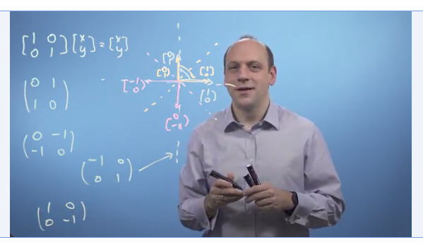
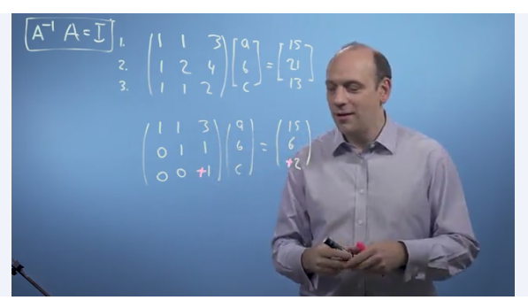
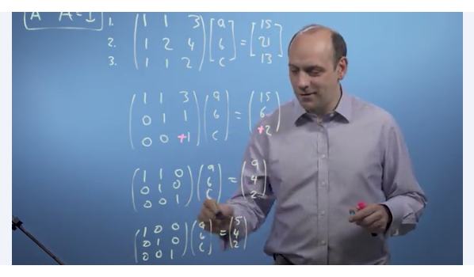
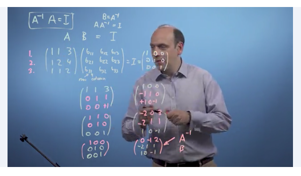
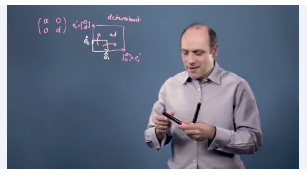
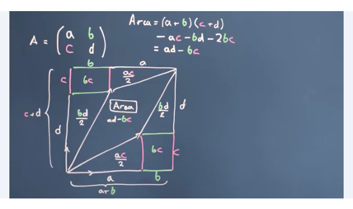

# Week 3 

* Suppose we have matrix `A` and vector `r`
* If we multiply them by some scalar value `n`, we get `A (nr) = nr'` where the vector `r` has been changed 
* We can prove and apply this rule further that suppose `r` and `s` are both vectors; `A(r+s) = Ar + As`

### Types of matrix transformation for skew

* No transformation:

$$\begin{bmatrix} 1 & 0\\\ 0&1\end{bmatrix} 
\begin{bmatrix} x\\\ y\end{bmatrix} = 
\begin{bmatrix} x\\\ y\end{bmatrix}$$

* Suppose we want to scale it unevenly (ie., shear): 

$$\begin{bmatrix} 3 & 0\\\ 0 & 2\end{bmatrix}
\begin{bmatrix} x\\\ y\end{bmatrix} = 
\begin{bmatrix} 3x\\\ 2y\end{bmatrix}$$

* Suppose we want to invert it along the horizontal plane, such that left becomes right and so on: 

$$\begin{bmatrix} -1 & 0\\\ 0 & 1\end{bmatrix}
\begin{bmatrix} x\\\ y\end{bmatrix} = 
\begin{bmatrix} -x\\\ y\end{bmatrix}$$

* Suppose we want to invert it along the vertical plane, such that top becomes bottom and so on: 

$$\begin{bmatrix} 1 & 0 \\\ 0 & -1\end{bmatrix}
\begin{bmatrix} x \\\ y\end{bmatrix} = 
\begin{bmatrix} x \\\ -y\end{bmatrix}$$

* Suppose we want to flip the image along a 45" plane (ie., the 2.30pm clock hand):

$$\begin{bmatrix} 0 & 1 \\\ 1 & 0\end{bmatrix}
\begin{bmatrix} x \\\ y\end{bmatrix} = 
\begin{bmatrix} y \\\ x\end{bmatrix}$$

* Suppose we want to flip the image along a 225" plane (ie., the 8.30pm clock hand):

$$\begin{bmatrix} 0 & -1 \\\ -1 & 0\end{bmatrix}
\begin{bmatrix} x \\\ y\end{bmatrix} = 
\begin{bmatrix} -y \\\ -x\end{bmatrix}$$

* Suppose we want to rotate it anti-clockwise by 90": 

$$\begin{bmatrix} 0 & -1 \\\ 1 & 0\end{bmatrix}
\begin{bmatrix} x \\\ y\end{bmatrix} = 
\begin{bmatrix} -y \\\ x\end{bmatrix}$$

* Suppose we want to rotate it clockwise by `n` degrees; we can use trigonometry in matrices to do so. Let $\theta$ be the designed clockwise angle: (so if you want it to rotate by -90", or anticlockwise 90", put that in as $\theta$. Using the previous example, 
$\sin\theta = \sin 90 = -1$. 

$$\begin{bmatrix} \cos\theta & \sin\theta \\\ 
-\sin\theta/ & \cos\theta\end{bmatrix}
\begin{bmatrix} x \\\ y\end{bmatrix}$$

Application: Image transformation occassionally (eg., to detect and fix skew in OCR or FR projects). 

### Solving simultaneous equations using gaussian elimination + back substitution

* We can solve equations by subtracting one "row" of the matrix" from another, and through simplifying the equations, solve it
* The screenshot above shows the matrix, where everything below the diagonal is `0`, is known as its `echelon form`. 
* We can easily solve a matrix in its echelon form 
* Arriving at this form gives us the answer (in some situations)

### Inverse of Matrix

* The identity matrix is defined as: 

$$\begin{bmatrix} 1 & 0 & 0\\\ 0 & 1 & 0\\\
0 & 0 & 1\end{bmatrix}$$

* We can write the formula for the identity as: $A . A^-1 = I$
* We can find what $A^-1$ is through repeatedly performing elimiation and back substitution: 
	* subtract row 1 from row 2 to give new row 2  
	* subtract row 1 from row 3 to give new row 3 
	* multiply row 3 by (-1)
	* subtract new row 3 from row 2 to give new row 2 
	* subtract new row 3 from row 1 to give new row 1 
	* subtract new row 2 from row 1 to give new row 1 
* Perform the same operations on the matrix on the right, aka the Identity
* The result of the "new" identity matrix will be equal to the inverse of A.  

### The Determinant

* Suppose we scale a matrix `[x, 0]` and `[0, y]` and we scale this larger by the formula below, we can say that **the new space is larger by a factor of `ad`**, and the determinant of this transformation matrix

$$\begin{bmatrix}a & 0\\\ 0 & d\end{bmatrix}$$

* Area of parallelogram = `ad - bc` 
* We can find the inverse of a matrix by flipping the terms on the diagonal to get the determinant: 

$$
\begin{bmatrix} a & b\\\ c & d\end{bmatrix}
\begin{bmatrix} d & -b\\\ -c & a\end{bmatrix} = 
\begin{bmatrix} ad - bc & 0\\\ 0 & ad - bc\end{bmatrix}
$$

* Don't really need how to manually calculate determinants anymore because python can handle all this for us
* Application: QR code decomposition 

> What happens when a matrix doesnt have linearly independent basis vectors? 

* Suppose we have a matrix that we want to scale a vector by, matrix A:

$$A = \begin{bmatrix}1 & 2\\\ 1 & 2\end{bmatrix}$$

* This means that the new points are [1,1] and [2,2] which does not form a rhombus, but instead, a line 
* Since [1,1] and [2,2] are on a line, then the determinant of that matris `|a| = 0` because **the area of a line is zero** 
* When the basis vectors are linearly independent, then the area = 0 then we cant inverse the matrix, it has no inverse, and there is NO SOLUTION 
* It's like if we collapse a 3D plane into a single 2D line, information is lost and we cant' re-expand the line to figure out where the plane is 

--> We need to check that basis vectors are linearly independent before trying to find its inverse and/or determinant