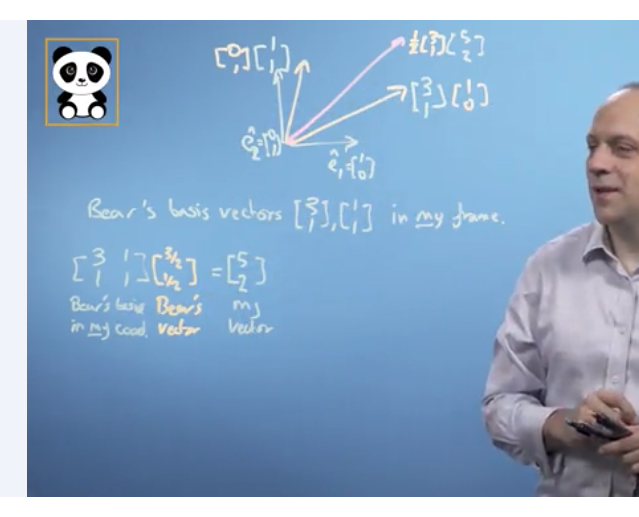

# Week 4 

### Einstein's notation

This is how to write out a matrix: 

$$\begin{bmatrix} a_{11} & a_{12} & ... & a_{1n}\\\ 
a_{21} & a_{22} & ... & a_{2n}\\\
... & ... &... &... &\\\ 
a_{n1} & a_{n2} & ... & a_{nn}\end{bmatrix}$$

We can write out the summation of any given row multiplied with any given column like this: 

$$\begin{bmatrix} b_{11} & b_{12} & ... & b_{1n}\\\ 
b_{21} & b_{22} & ... & b_{2n}\\\
... & ... &... &... &\\\ 
b_{n1} & b_{n2} & ... & b_{nn}\end{bmatrix} = 
\begin{bmatrix} A & B \end{bmatrix}$$

In other words:

$$ab_{23} = a_{21}b_{13} + a_{22}b_{23} + ... + a_{2n}b_{n3}$$

Or formally:

$$(ab)_{ik} = \sum_{j} a_{ij}b_{jk} = a_{ij}b_{jk}$$

### Dot projection

* What if we multiplied any given vector, R, by one of its unit vectors (eg., the x-axis)? 
	* We would get the length of the vector ALONG the x-axis, aka, the dot projection of that vector along another vector
* Using einstein's notation, we can show that the dot product, or when multiplying any given vector by another, would give the projection of the first vector along the second vector.  

### Changing Basis 

 

* Previously we assumed all basis vectors would nicely fit the x= [0,1] and y=[1, 0] default

$$x = \begin{bmatrix} 0 \\\ 1 \end{bmatrix} 
y = \begin{bmatrix} 1 \\\ 0 \end{bmatrix}
r = \begin{bmatrix} 5 \\\ 2 \end{bmatrix}$$ 

* What if we have a separate basis now? like x=[3,1] and y=[1,1]? How do we express new vectors from the old standard into the new basis vectors?

$$x' = \begin{bmatrix} 3 \\\ 1 \end{bmatrix} 
y' = \begin{bmatrix} 1 \\\ 1 \end{bmatrix}
r = ?$$

* Combine the original basis vectors into single matrix

$$current = \begin{bmatrix} 1 & 0 \\\ 0 & 1 \end{bmatrix}$$
$$new = \begin{bmatrix} 3 & 1 \\\ 1 & 1 \end{bmatrix}$$

* Multiply the new basis vectors by the target vector (in this case, the pink line) and this will return the same vector but in OUR basis 
 
$$\begin{bmatrix} 3 & 1 \\\ 1 & 1 \end{bmatrix}
\begin{bmatrix} 3/2 \\\ 1/2 \end{bmatrix} = 
\begin{bmatrix} 5 \\\ 2 \end{bmatrix}$$

**Recap: Finding the determinant**

$$D = \begin{bmatrix} a & b \\\ c & d \end{bmatrix}$$

$$D^{-1} = {1\over(ad-bc)}\begin{bmatrix} d & -b \\\ -c & a \end{bmatrix}$$

* Applied example: "My basis vectors (0,1) and (1,0) in the other basis coordinates"

$$D = \begin{bmatrix} 3 & 1 \\\ 1 & 1 \end{bmatrix}
D^{-1} = {1\over2}\begin{bmatrix} 1 & -1 \\\ -1 & 3 \end{bmatrix}$$

**How to reverse and find our changed vector in the other basis?**

* State the new basis vectors in our coordinates, $D$
* Find the inverse determinant of the new basis vectors, $D^{-1}$ 
* Multiply this by our current vector $r$, to get the same vector in the changed basis $r'$ 

$$D^{-1} = {1\over2}\begin{bmatrix} 1 & -1 \\\ -1 & 3 \end{bmatrix}$$

$$r = \begin{bmatrix}5 \\\ 2 \end{bmatrix}$$

$$r' = D^{-1}r$$

$${1\over2}\begin{bmatrix} 1 & -1 \\\ -1 & 3 \end{bmatrix}
\begin{bmatrix}5 \\\ 2 \end{bmatrix} = 
\begin{bmatrix} 3/2 \\\ 1/2 \end{bmatrix}$$

