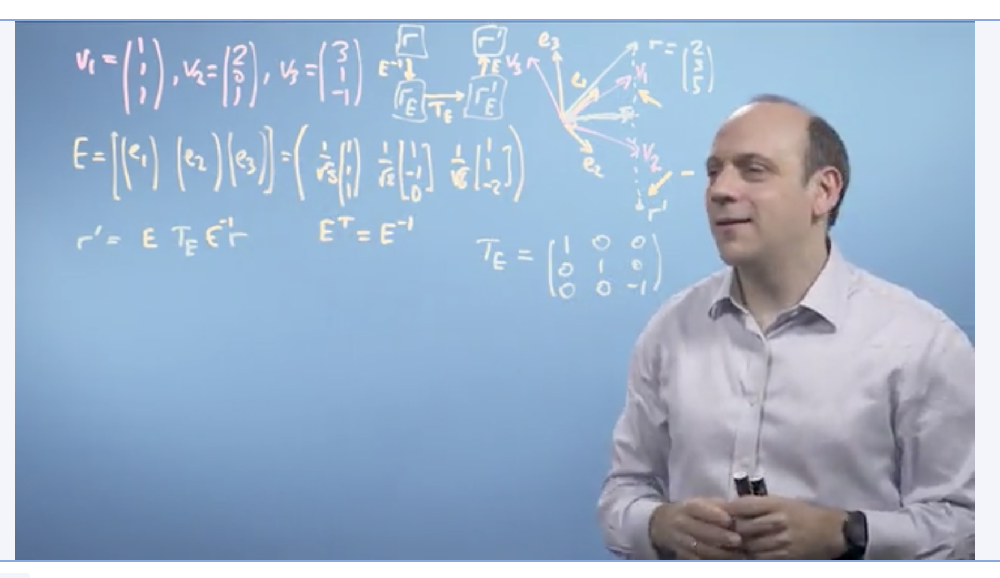

# Week 4 

### Einstein's notation

This is how to write out a matrix: 

$$\begin{bmatrix} a_{11} & a_{12} & ... & a_{1n}\\\ 
a_{21} & a_{22} & ... & a_{2n}\\\
... & ... &... &... &\\\ 
a_{n1} & a_{n2} & ... & a_{nn}\end{bmatrix}$$

We can write out the summation of any given row multiplied with any given column like this: 

$$\begin{bmatrix} b_{11} & b_{12} & ... & b_{1n}\\\ 
b_{21} & b_{22} & ... & b_{2n}\\\
... & ... &... &... &\\\ 
b_{n1} & b_{n2} & ... & b_{nn}\end{bmatrix} = 
\begin{bmatrix} A & B \end{bmatrix}$$

In other words:

$$ab_{23} = a_{21}b_{13} + a_{22}b_{23} + ... + a_{2n}b_{n3}$$

Or formally:

$$ab_{ik} = \sum_{j} a_{ij}b_{jk} = a_{ij}b_{jk}$$

### Dot projection

* What if we multiplied any given vector, R, by one of its unit vectors (eg., the x-axis)? 
	* We would get the length of the vector ALONG the x-axis, aka, the dot projection of that vector along another vector
* Using einstein's notation, we can show that the dot product, or when multiplying any given vector by another, would give the projection of the first vector along the second vector.  

### Changing Basis 

 

* Previously we assumed all basis vectors would nicely fit the x= [0,1] and y=[1, 0] default

$$x = \begin{bmatrix} 0 \\\ 1 \end{bmatrix} 
y = \begin{bmatrix} 1 \\\ 0 \end{bmatrix}
r = \begin{bmatrix} 5 \\\ 2 \end{bmatrix}$$ 

* What if we have a separate basis now? like x=[3,1] and y=[1,1]? How do we express new vectors from the old standard into the new basis vectors?

$$x' = \begin{bmatrix} 3 \\\ 1 \end{bmatrix} 
y' = \begin{bmatrix} 1 \\\ 1 \end{bmatrix}
r = ?$$

* Next, we need to combine the original basis vectors into single matrix

$$current = \begin{bmatrix} 1 & 0 \\\ 0 & 1 \end{bmatrix}$$
$$new = \begin{bmatrix} 3 & 1 \\\ 1 & 1 \end{bmatrix}$$

* Then, we need to multiply the new basis vectors by the target vector (in this case, the pink line). This will return the same vector, but in OUR basis. 
 
$$\begin{bmatrix} 3 & 1 \\\ 1 & 1 \end{bmatrix}
\begin{bmatrix} 3/2 \\\ 1/2 \end{bmatrix} = 
\begin{bmatrix} 5 \\\ 2 \end{bmatrix}$$

**Recap: Finding the determinant**

$$D = \begin{bmatrix} a & b \\\ c & d \end{bmatrix}$$

$$D^{-1} = {1\over(ad-bc)}\begin{bmatrix} d & -b \\\ -c & a \end{bmatrix}$$

* Applied example: "My basis vectors (0,1) and (1,0) in the other basis coordinates"

$$D = \begin{bmatrix} 3 & 1 \\\ 1 & 1 \end{bmatrix}
D^{-1} = {1\over2}\begin{bmatrix} 1 & -1 \\\ -1 & 3 \end{bmatrix}$$

**Summary: How to find our vector in a changed basis?**

* State the new ('changed') basis vectors in our coordinates, $D$
* Find the inverse determinant of the new basis vectors, $D^{-1}$ 
* Multiply this by our current vector $r$, to get the same vector in the changed basis $r'$ 

$$D^{-1} = {1\over2}\begin{bmatrix} 1 & -1 \\\ -1 & 3 \end{bmatrix}$$

$$r = \begin{bmatrix}5 \\\ 2 \end{bmatrix}$$

$$r' = D^{-1}r$$

$${1\over2}\begin{bmatrix} 1 & -1 \\\ -1 & 3 \end{bmatrix}
\begin{bmatrix}5 \\\ 2 \end{bmatrix} = 
\begin{bmatrix} 3/2 \\\ 1/2 \end{bmatrix}$$

### Transformation in a changed basis 

* Suppose we want to rotate or transform a given vector 
* We know how to do this in our basis, but not in a new, changed basis 
* We need to: 
	1. Find the transformation in our basis, $R$
	2. Find the new changed basis, $B$
	3. Find the inverse of the new changed basis, $B^{-1}$
	4. State the vector to be changed, $v$
* Formula for rotation in a changed basis: (the order matters!!) 

$$B^{-1} . R . B . v$$

### Reflecting in a plane 

*Note: This lecture came last in the series but I felt it makes most sense when viewed DIRECTLY AFTER the one on Transformation in a changed basis. The reason is that the formula and applications are the same, only now, we are doing it in a 3D plane not a 2D plane.*

* Formula for mirror inversion in a 3D basis: (Explanation: Suppose we only want to flip an image's height, from being "on top of a table" to be "under the table") 
* We can define the transformation matrix, $R$, as this: 

$$\begin{bmatrix} 1 & 0 & 0\\\ 
0 & 1 & 0 \\\
0 & 0 & -1\end{bmatrix}$$

* Apply the Gram-Schmidt process to transform the original vectors into orthorgonal basis vectors, $B$ 
* Find the inverse of that, $B^{-1}$, which will help us to re-convert our vector back into the other basis vectors
* Put everything together and the formula is the same: 

$$B^{-1} . R . B . v$$

Above: Formula before application

Above: Formula with everything worked out

### Orthorgonal matrices

Recap: Transposing a matrix looks like this above. 

* What happens if we multiply a transposed matrix by itself, and the matrix's rows are ORTHORGONAL (ie., 90") to each other? 
* We get the **identity matrix**
* A matrix with unit length basis vectors that are all orthorgonal to each other are called an **orthonormal basis set**.

TLDR: Wherever possible, try to use an orthogonal matrix set where the unit vectors are all the same standard size, and at 90" to each other. Benefits:

1. The inverse is easy to compute
2. Transformation is reversible
3. Projection is just the dot product 

### The Gram-Schmidt process

*Aka: How to construct and orthonormal basis for use*

Suppose we have a set of non-orthorgonal vectors that we want to convert: 

$$ V = {v_1, v_2, ... , v_n}$$ 

We can start by changing the first vector, $v_1$, into a unit vector for further calculation, $e_1$... by normalising it against itself. 

$$e_1 = {v_1\over{|v_1|}}$$

We can change the second vector $v_2$ through two steps. First, we find its length against $v_1$ through the dot product. This gives us the length of $v_2$ in $e_1$ units: 

$$v_2 = (v_2.e_1){e_1\over|e_1|} $$ 

After, we add this with the projection of $v_2$ against a vector perpendicular to $v_1$, which we'll call $u_2$. 

$$u_2 = v_2 - (v_2 . e_1)e_1$$

Lastly, to get the second orthorgonal unit vector $e_2$, we normalise the horizontal component by itself:

$$e_2 = {u_2\over{|u_2|}}$$

Bonus: Earlier, we found the "horizontal" length of vector $v_2$ in $e_1$ units only. To get the FULL formula for $v_2$ in both $e_1$ and $e_2$:  

$$v_2 = (v_2.e_1){e_1\over|e_1|} + u_2 $$ 

Now for the third vector, we extend the first two steps. We can recursively find the dot product of each vector against their unit vectors, which necessitates us calculating the expanding unit vectors. Like this:

$$u_3 = v_3 - (v_3 . e_1)e_1 - (v_3 . e_2)e_2$$

And we can find the last unit vector $e_3$ like this:

$$e_3 = {u_3\over{|u_3|}}$$

**Example**

* Image above: WE're given 3 vectors 
* Everything is calculated up to the second vector, $v_2$

