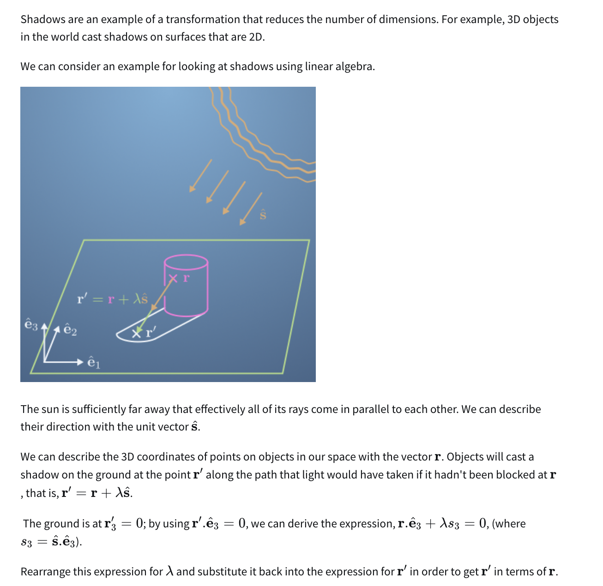
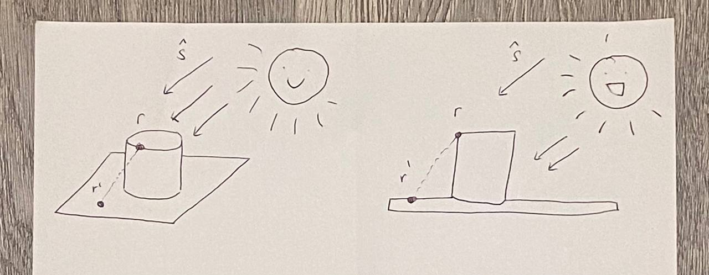
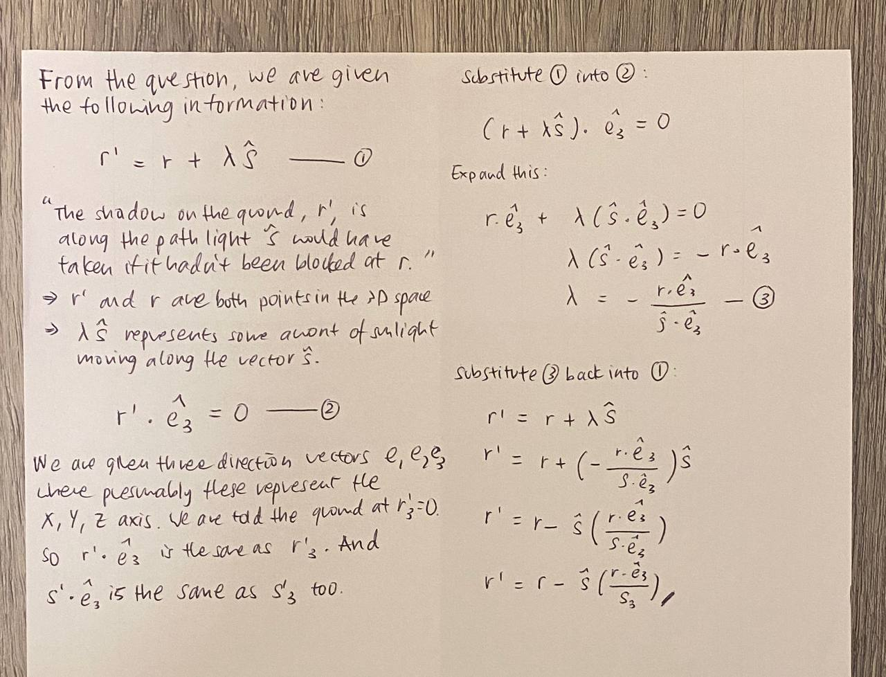
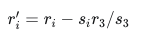
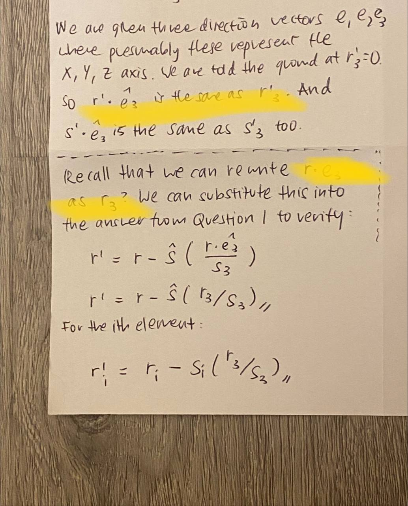
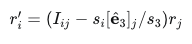
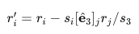
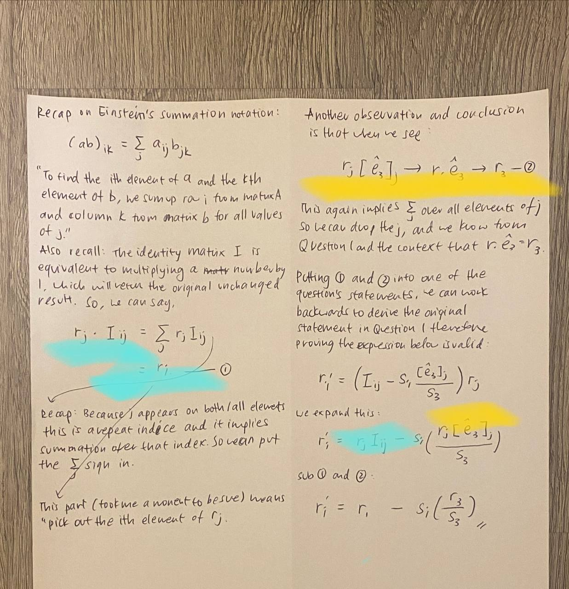
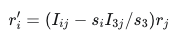
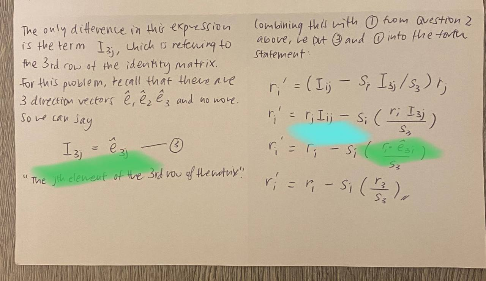

# Special Assignment – Using Non-square Matrices to do a Projection

This is a more challenging exercise and I had so much fun puzzling over it! Frankly anyone can get the correct answers online (or via Coursera, with sufficient attempts at guessing), but I have yet to see an explanation posted online, so this is my contribution. 

After completing the rest of the course, I can say that you don't necessarily have to get 100% on this assignment, or even pass the quiz, to have a good overall grasp of the concepts in this course. So don't worry if your grade for this quiz was too not good. 

### Question 

We are given the diagram: 

To simplify, we can express this in 2D form like so:

(Above left: 3D image; right: 2D image) 

### Question 1 

Question: Rearrange this expression for $\lambda$ and substitute it back into $r'$ in order to get $r'$ in terms of $r$. 

Solution: 

* Tbh we don't even need to really bother about the problem context for question 1
* This is just a matter of algebra manipulation for simultaneous equations

### Question 2 

Question: From question 1, you should see that $r'$ can be written as a linear transformation of $r$. This means we should be able to write $r' = Ar$ for some matrix $A$. To help us find an expression for $A$, we can re-write the expression above with Einstein summation convention. Which of the answers below correspond to the answer for Question 1? Select all that apply. 

Solution:

* We will apply einstein's summation notation and identity matrices for this 
* We can find the expression for matrix A by working backwards on each statement
* Let's work on this statement by statement then show the combined answer at the bottom

**First statement**

**Second and third statement**

I accidentally proved them together so here they are explained together. 

We will see that the third statement is simply the second statement's brackets expanded out. The reasoning for the transformation of $I_{ij}$ to $r_i$ is in the blue highlighted area. And the reasoning for the next transformation of $$r_j[\hat e_3]_j$ to $r_3$ is in yellow. Sorry the opacity of the highlight colour is kind of crazy, I could not find a highlighter in my room so I made this on my phone. 

**Fourth statement**

In case you can't read the handwriting:

* The only difference in this expression is the term $I_{3j}$, which is referring to the 3rd row of the identity matrix 
* For this problem, recall that there are 3 direction vectors $\hat e_1, \hat e_2, \hat e_3$ 

