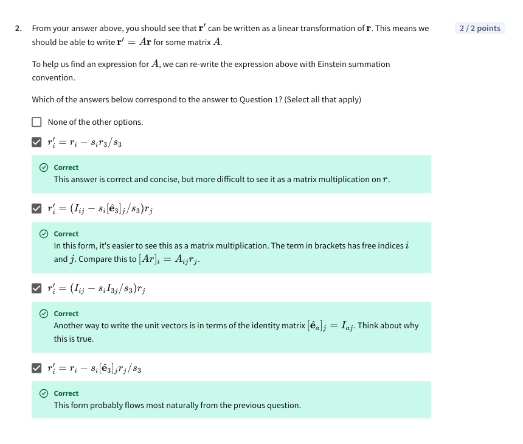

# Special Assignment – Using Non-square Matrices to do a Projection

### Context

This problem can be simplified to this: (left: 3D image; right: 2D image).

### Question 1 

Question: Rearrange this expression for $\lambda$ and substitute it back into $r'$ in order to get $r'$ in terms of $r$. 

Solution: 

* Tbh we don't even need to really bother about the problem context for question 1
* This is just a matter of algebra manipulation for two simultaneous equations provided

The answer: 

### Question 2 

Question: From question 1, you should see that $r'$ can be written as a linear transformation of $r$. This means we should be able to write $r' = Ar$ for some matrix $A$. To help us find an expression for $A$, we can re-write the expression above with Einstein summation convention. Which of the answers below correspond to the answer for Question 1? Select all that apply. 

Approach:

* We will apply einstein's summation notation and identity matrices for this 
* We can find the expression for matrix A by working backwards on each statement
* Let's work on this statement by statement then show the combined answer at the bottom

**First statement**

**Second and third statement**

I proved the second one before realising it is extremely similar to the third statement, so here they are, explained together. 

We will see that the third statement is simply the second statement's brackets expanded out. The reasoning for the transformation of $I_{ij}$ to $r_i$ is in the blue highlighted area. And the reasoning for the next transformation of $r_j[\hat e_3]_j$ to $r_3$ is in yellow. Sorry the opacity of the highlight colour is kind of thick, I could not find a highlighter in my room so I made this on my phone. 

**Fourth statement**

In case you can't read the handwriting:

* The only difference in this expression is the term $I_{3j}$, which is referring to the 3rd row of the identity matrix 
* For this problem, recall that there are 3 direction vectors $\hat e_1, \hat e_2, \hat e_3$ and no more. So we can say $I_{3j} = \hat e_3$. 

**Combining everything together...**

--> We proved all 4 statements are derivations of the original and are valid expressions of $r' = Ar$. This is the correct answer.

### Question 3 

Question: Based on your answers to the previous question, or otherwise, you should now be able to give an expression for $A$ in its component form by ealuating the components $A_{ij}$ for each row $i$ and $j$. Since $A$ will take a 3D vector, $r$, and transform it into a 2D vector, $r'$, we only need to write the first two rows of $A$. That is, $A$ will eb a 2x3 matrix. Remmeber, the columns of a matrix are the vectors in the new space that the unit vectors of the old space transform to - and in our new space, our vectors will be 2D. What is the value of $A$? 

Approach:

* We pick one of the statements from question 2 and create the matrix from there
* Since we know what the identity is, and what each direction vector is (recall: x-axis, y-axis, z-axis), i think its easiest if we work from the GREEN circled statement
* Values circled in PURPLE are related -- we substitute them from the left, into the right (highlighted so it doesnt appear like I'm skipping steps)
* I wrote the last line wrongly! The last line should be $s_2 \over s_3$ instead of $s_1 \over s_3$, as written in every line before it. 

### Question 4 

Question: $A$ is a 2x3 matrix, but if you were to evaluate its third row, what would its components be? 

Solution:

* This is pretty simple, we just extend the expression from question 3 
* Meaning, we previously found out all the values when $i = 1$ and $i = 2$, now we do it for. $i = 3$. 
* The purple circles correspond to how we can vind the values for $\hat e_3$ in question 3 (also circled in purple)

### Question 5 

Question: Assume the Sun's rays come in at a direction $\hat s = \begin{bmatrix} 4/13 \\\ -3/13 \\\ -12/13 \end{bmatrix}$. Construct the matrix $A$, and apply it to a point $r = \begin{bmatrix} 6 \\\ 2 \\\ 3 \end{bmatrix}$, on an object in our space to find the coordinates of that point's shadow. Give the coordinates of $r'$. 

*(Handwriting getting squiggly but I'm not going to rewrite this)*

### Question 6 

Question: Another use of non-square matrices is applying a matrix to a list of vectors. Given our transformation $r' = Ar$, this can be generalised to a matrix equation $R' = AR$, where $R'$ and $R$ are matrices, and where each column's corresponding $r'$ and $r$ are vectors. 

In Einstein notation, $r'_i = A_{ij}r_j$ becomes $R'_{ia} = A_{ij}R_{ka}$. 

For the same $\hat s$ as in the previous quesiton, apply $A$ to the matrix. Observe that it is the same result as treating the columns as separate vectors and calculating them individually. 

### Closing comment

This is a more challenging exercise and I had so much fun puzzling over it! Frankly anyone can get the correct answers online (or via Coursera, with sufficient attempts at guessing), but there is neither an explanation posted online, nor one given by the official course, so this is my contribution. 
