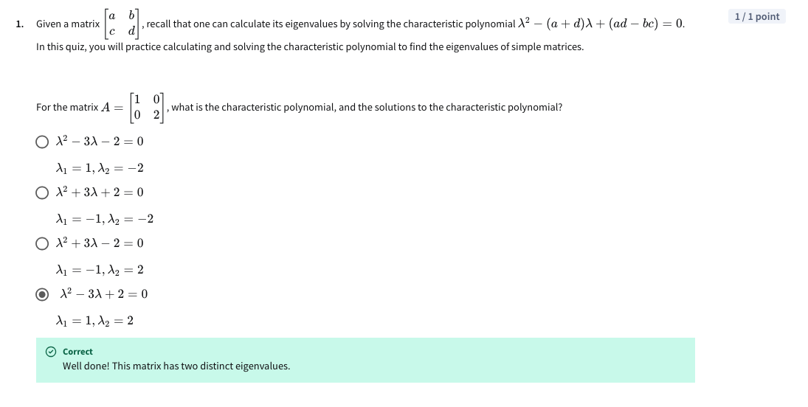
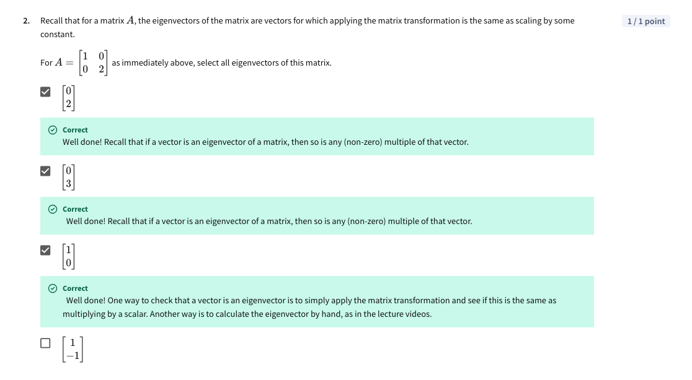
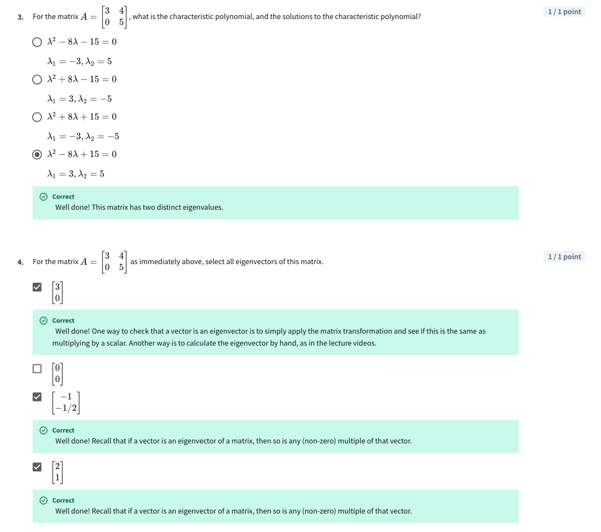
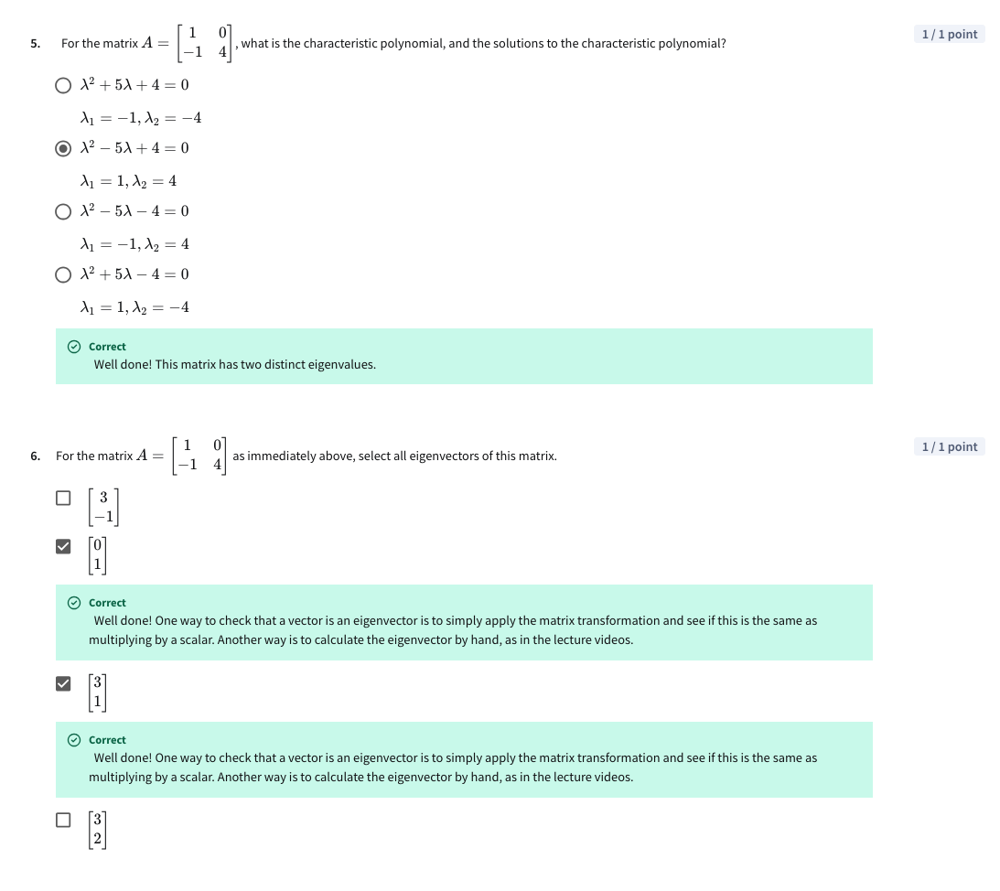
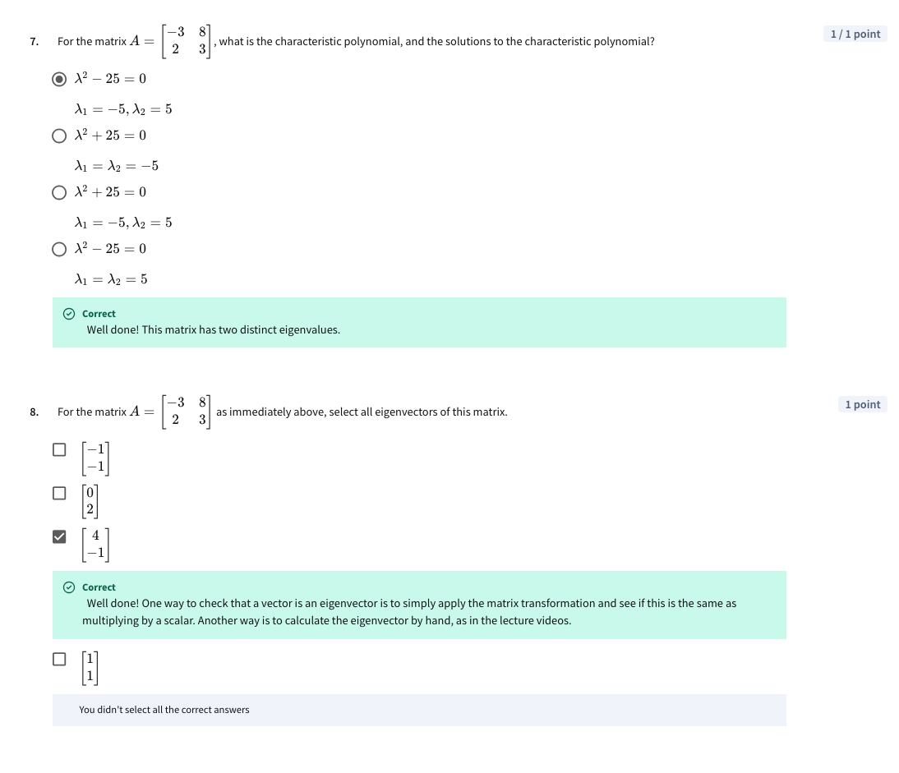
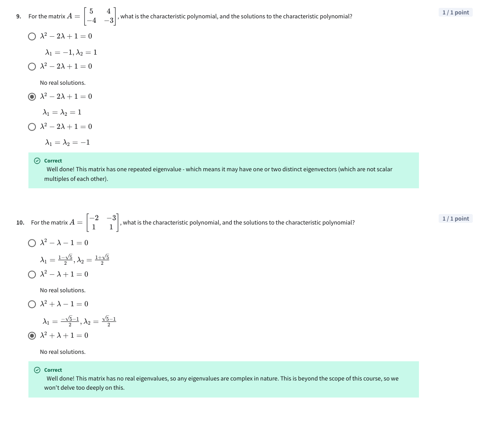

# Assignment – Characteristic polynomials, eigenvalues and eigenvectors

For this assignment, I felt like this video is much more helpful than the lecture, maybe because it has animations? The lecture doesn't really explain how eigenvectors are calculated and skips over many steps. 

* https://www.youtube.com/watch?v=TQvxWaQnrqI&ab_channel=ProfessorDaveExplains

Note: For question 8, the option [1, 1] should also have been selected. 

