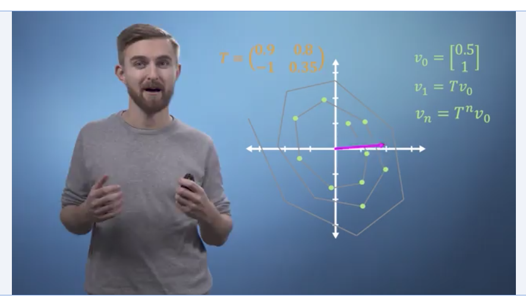
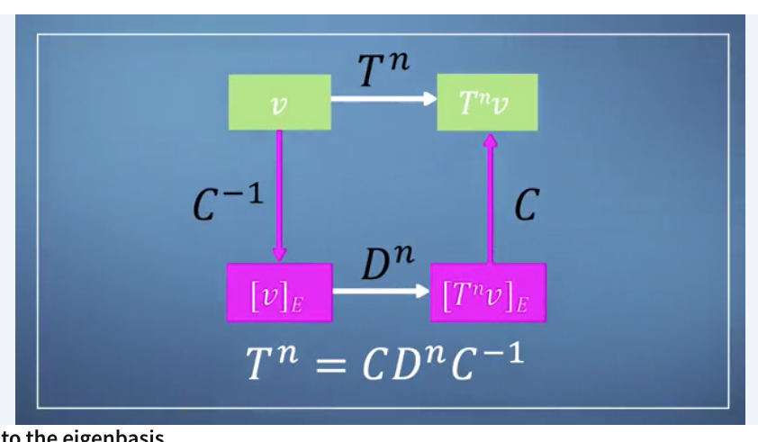
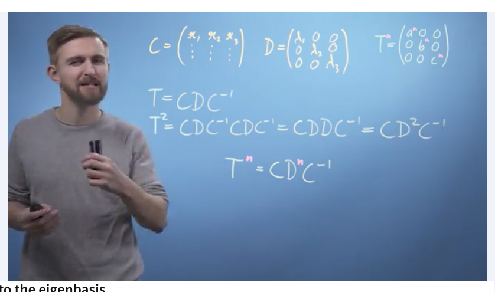

# Lecture

### Eigenvectors and eigenvalues 

* **Eigenvectors** are vectors which lie along the same span both before and after applying a linear transformation to a space
* **Eigenvalues** are a scalar value that each of those vectors hve been stretched in the transformation process 

**Unform scaling**

* Scale by the same amount in each direction 
* All vectors could be eignevectors

**180" rotation**

* All eigenvectors are now pointing in the opposite direction 
* However, because they are still along the same span/ line, they are still considered as the SAME eigenvector

**Shear**

* Horizontal vector remains the same 
* One vector between pink and orange vector has also not changed 
* Point is, it is hard to spot eigenvectors that have/have not changed, and its helpful to calculate them instead 

### Calculating Eigenvectors 

Goal: 

* Try to calculate the eigenvectors and eigenvalues of a matrix, if it exists 

Formula:

* Let $A$ be some transformation matrix
* Let $x$ be our eigenvector 
* Let $\lambda$ be some scalar value 

$$Ax = \lambda x$$

This means, when we're applying transformation matrix $A$ to vector $x$, this is equal to stretching that factor $x$ by some scalar value $\lambda$. To check if some eigenvalues exist for transformation $A$, we can solve for $x$. If there is no value for $x$ then no eigenvalues exist.

**How to solve for this?**

To recap, we start with this statement: 

$$Ax = \lambda x$$

We can factorise as this: (when we expand out, we can't subtract a scalar value from a matrix, so we have to represent $x$ in the brackets using $I$, the identity matrix.

$$(A - \lambda I)x = 0$$

We don't care about when $x$ = 0 because that's not useful. We only care about when $(A-\lambda I) = 0$ because that will help us check if any eigenvalues exist. We can check whether that expression will equal to zero by finding its **determinant**:

$det(A-\lambda I) = 0$

Recall that finding determinants would be like this: 

Suppose we represent the matrix $A$ like this:

$$A = \begin{bmatrix} a & b \\\ c & d \end{bmatrix}$$

Then:

$$det(\begin{bmatrix} a & b \\\ c & d \end{bmatrix}- \lambda \begin{bmatrix} 1 & 0 \\\ 0 & 1 \end{bmatrix})=0$$

$$det(\begin{bmatrix} a & b \\\ c & d \end{bmatrix}) - \begin{bmatrix} \lambda & 0 \\\ 0 & \lambda \end{bmatrix})=0$$

$$det(\begin{bmatrix} a - \lambda & b+0 \\\ c - \lambda & d+0 \end{bmatrix})=0$$

This is equal to a **characteristic polynomial** which transforms the expression above into this below. Our eigenvalues will be the solution for this equation:

$$\lambda^2 - (a+d)\lambda + ad - bc = 0$$

**Live example: Standard scaling**

Summary of the lecture/ screenshot above:

Suppose we have the transformation, A, be the matrix 

$$A = \begin{bmatrix} 1 & 0 \\\ 0 & 2 \end{bmatrix}$$

Put A into the determinant form:

$$det(\begin{bmatrix} a - \lambda & b+0 \\\ c - \lambda & d+0 \end{bmatrix}=0$$

We solve and find that $\lambda=1$ and $\lambda=2$.

Substitute those values back into 

$$det(\begin{bmatrix} a - \lambda & b+0 \\\ c - \lambda & d+0 \end{bmatrix}\begin{bmatrix}x_1 \\\ x_2\end{bmatrix} = 0$$

We find that:

$$@ \lambda = 1 : x = \begin{bmatrix}t \\\ 0\end{bmatrix}$$

--> When lambda = 1 or that as long as $x_2 = 0$, any $x_1$ value will still constitute an eignevector

--> Similarly we find that when $\lambda = 2$, as long as $x_1 = 0$, any $x_2$ value will still constitute an eignevector.

**Live example: Rotation by 90"**

Suppose we have the transformation, A, be the matrix $(\begin{bmatrix} 0 & -1 \\\ 1 & 0 \end{bmatrix}$.

We know from earlier that this 90" rotation does not have any eigenvectors but lets still test it. Put A into the determinant form 

$$det(\begin{bmatrix} a - \lambda & b+0 \\\ c+0 & d - \lambda \end{bmatrix})=0$$

This gives us: 

$$det(\begin{bmatrix} a - \lambda & -1 \\\ 1 - \lambda & 0 - \lambda \end{bmatrix})$$

Expand the determinant using the formula $ad - bc$ will give us the statement below, which we know has no solution. This means that this transformation A has no eignevectors. 

$$\lambda^2 +1 = 0$$ 

**Concluding remarks**

* Strong conception understanding is more important 
* Dont really need to learn to calculate manually by hand

---------------------------------------------------------

### Scaling up multiplication of matrices

 

Problem: What if we need to multiply a vector by a transformation multiple times? This is computationally expensive. We can solve this through identifying the eigenvector(s) os the matrix, $C$, represented as a diagonal matrix $D$, in order to convert the transformation matrix $T$ by $n$ times.

* $v$ is the original matrix
* $n$ is the number of times we want to multiply it in our question 
* $C$ is the concatenation of eigenvector(s) from $v$ 
* $C^{-1}$ is the inverse of $C$
* $D$ is the diagonal matrix of all $\lambda$ eigenvalues
* $T$ is the transformation matrix, aka $T^n = CD^nC^{-1}$

**Applied example**

Let the vector $v$ be

$$v = \begin{bmatrix} -1 \\\ 1 \end{bmatrix}$$

Let the desired transformation $T$ be:

$$T = \begin{bmatrix} 1 & 1 \\\ 0 & 2 \end{bmatrix}$$

Solving $T$ gives the following eigenvectors and values:

$$@\lambda_1 = 1: = \begin{bmatrix} 1 \\\ 0 \end{bmatrix}$$

$$@\lambda_2 = 2: = \begin{bmatrix} 1 \\\ 1 \end{bmatrix}$$ 

We combine the eigenvectors $1, 2$ to form $C$:

$$C = \begin{bmatrix} 1 & 1 \\\ 0 & 1 \end{bmatrix}$$

$$C^{-1} = \begin{bmatrix} 1 & -1 \\\ 0 & 1 \end{bmatrix}$$

We combine the eigenvalues to form the diagonal matrix $D$:

$$C = \begin{bmatrix} 1 & 0 \\\ 0 & 2 \end{bmatrix}$$

Now we solve for $T$:

$$T^n = CD^nC^{-1}$$

$$T^2 = CD^2C^{-1}$$

$$T^2 = \begin{bmatrix} 1 & 1 \\\ 0 & 1 \end{bmatrix} \begin{bmatrix} 1 & 0 \\\ 0 & 2 \end{bmatrix}^2 \begin{bmatrix} 1 & -1 \\\ 0 & 1 \end{bmatrix}$$

$$T^2 = \begin{bmatrix} 1 & 3 \\\ 0 & 4 \end{bmatrix}$$

Finally we solve for $T^2.v$:

$$T^2.v = \begin{bmatrix} 1 & 3 \\\ 0 & 4 \end{bmatrix}\begin{bmatrix} -1 \\\ 1 \end{bmatrix})$$

$$T^2.v = \begin{bmatrix} 2 \\\ 4 \end{bmatrix}$$

Exclusion

* Undiagonisable matrices
* Complex and imaginary solutions

-----------------------------------------------

### Introduction to Pagerank

* The importance of a website can be measured by how it ranks to other webpages
* The ranks on all pages depend on all others; this is a self-referential problem
* Each row is 0, 1 depending on whether a link to that corresponding page exists from the current page 
* WE normalise the vector by the total number of links, such that each value represents a probability of that link being clicked for that page 
* Formula:

$$M = d L + {{1-d}\over{n}} J$$

* Above: $n$ represents the number of elements, $L$ represents the probability matrix of each element connecting to another, $d$ represents the damping factor and $J$ is the $nxn$ matrix where every element is one.
* Lab covers the of diagonalisation to write pagerank formula